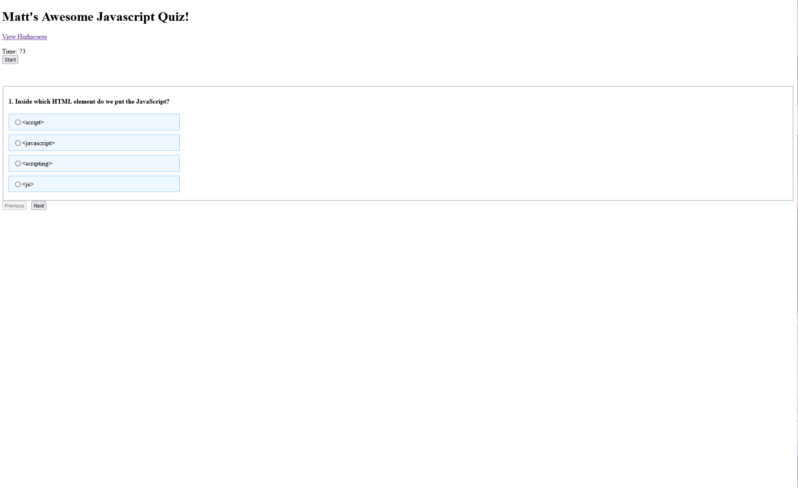

# Matt's awesome-javascript-quiz

## Description
My goal was to create a functional, user friendly, JavaScript quiz with clean and proper code. Motivation was to help others learn about Java Script in a fun setting. 
## Installation

Quiz renders questions with multiple choise answers. quiz is timed, incorrect answers will deduct 10 seconds from the clock. At the end of the game the user is given a score, as well as the option to enter their initials for the highscore list. 

## Usage

## Credits

code help: 

youtube.com

w3schools.com

Quiz questions: w3schools.com

study group with KU bootcamp classmates, as well as a bootcamp tutor. 

## License 

MIT License

Copyright (c) [2022] [Matthew Tierney]

Permission is hereby granted, free of charge, to any person obtaining a copy
of this software and associated documentation files (the "Software"), to deal
in the Software without restriction, including without limitation the rights
to use, copy, modify, merge, publish, distribute, sublicense, and/or sell
copies of the Software, and to permit persons to whom the Software is
furnished to do so, subject to the following conditions:

The above copyright notice and this permission notice shall be included in all
copies or substantial portions of the Software.

THE SOFTWARE IS PROVIDED "AS IS", WITHOUT WARRANTY OF ANY KIND, EXPRESS OR
IMPLIED, INCLUDING BUT NOT LIMITED TO THE WARRANTIES OF MERCHANTABILITY,
FITNESS FOR A PARTICULAR PURPOSE AND NONINFRINGEMENT. IN NO EVENT SHALL THE
AUTHORS OR COPYRIGHT HOLDERS BE LIABLE FOR ANY CLAIM, DAMAGES OR OTHER
LIABILITY, WHETHER IN AN ACTION OF CONTRACT, TORT OR OTHERWISE, ARISING FROM,
OUT OF OR IN CONNECTION WITH THE SOFTWARE OR THE USE OR OTHER DEALINGS IN THE
SOFTWARE.

